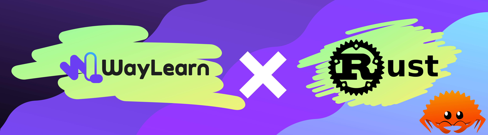
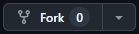
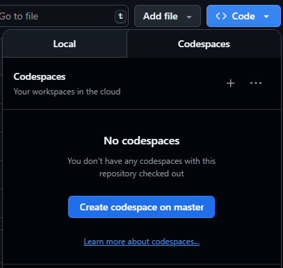
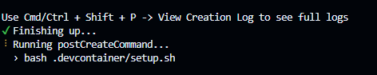
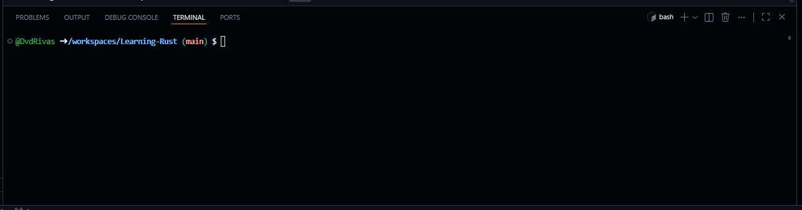

# Learning-Rust

Bienvenidos a este repositorio, donde te guiaremos paso a paso en tu proceso de aprendizaje de Rust 🦀, no importa si eres nuevo en el ámbito de la programación o si ya tienes experiencia en algún otro lenguaje! 

Puedes comenzar dándole Fork a este repositorio (abajo te explicamos como 👇), **hemos preparado un entorno de codespaces listo para que no tengas que instalar nada**, solo déjate llevar por la fluidez de los ejercicios y temas desarrollados especialmente para ti. 

Asegúrate de clonar este repositorio a tu cuenta usando el botón **`Fork`**.

* Puedes renombrar el repositorio a lo que sea que se ajuste con tu proyecto.
* Presiona el botón **`<> Code`** y luego haz click en la sección **`Codespaces`**

* Por último, presiona **`Create codespace on master`**. Esto abrirá el proyecto en una interfaz gráfica de Visual Studio Code e instalará todas las herramientas necesarias para empezar a programar (es muy importante esperar a que este proceso termine):

El proceso de instalación finaliza cuando la terminal se reinicia y queda de la siguiente manera:

---
## ⚠️ Nota ⚠️

No olvides que es muy importante fijarte un objetivo para poder medir tu progreso en el dominio del lenguaje. Puedes empezar con algo pequeño, como crear un programa de línea de comandos que lea datos del usuario, una calculadora sencilla, o un conversor de unidades. Eventualmente, podrías proponerte proyectos un poco más grandes, como un gestor de tareas en consola, un servidor web básico, un juego simple, o incluso una pequeña herramienta de sistema.
Recuerda que en el mundo de la programación el cielo es el único límite 🚀✨!

